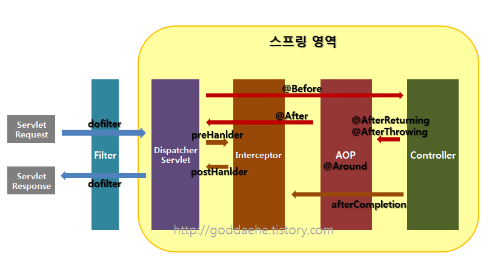

## 동작 순서는 위와 같다. (필터 -> 인터셉터 -> AOP)

## 필터
- #### HTTP 요청에 대한 전후처리
- #### 스프링 영역의 바깥에 있기 때문에 ExceptionHandler 는 필터에서 발생한 예외를 처리하지 못함
- #### HTTP 요청을 직접 수정 가능함 (이동할 url 변경/ 요청에 헤더를 추가/ 응답 바디 변경 등)

## 인터셉터
- #### 컨트롤러의 동작 (view 처리)의 전후처리

### 위 둘은 url에 매핑해서 적용한다.

## AOP
- #### 매서드 단위에 붙일 수 있는 전후처리 (서비스/레포지터리 단위에서 사용.)
- #### 관점 지향적 프로그래밍을 위한 방식이라 볼 수 있다. (모든 엔티티에 대해서, 데이터 생성시에 로그를 남기고자 할 때) 모든 service 클래스의 create 매서드마다 로그 남기는 로직을 추가하기보다는 -> AOP 를 사용해서 해당 매서드들만 로그 남기도록 관리할 수 있다.
